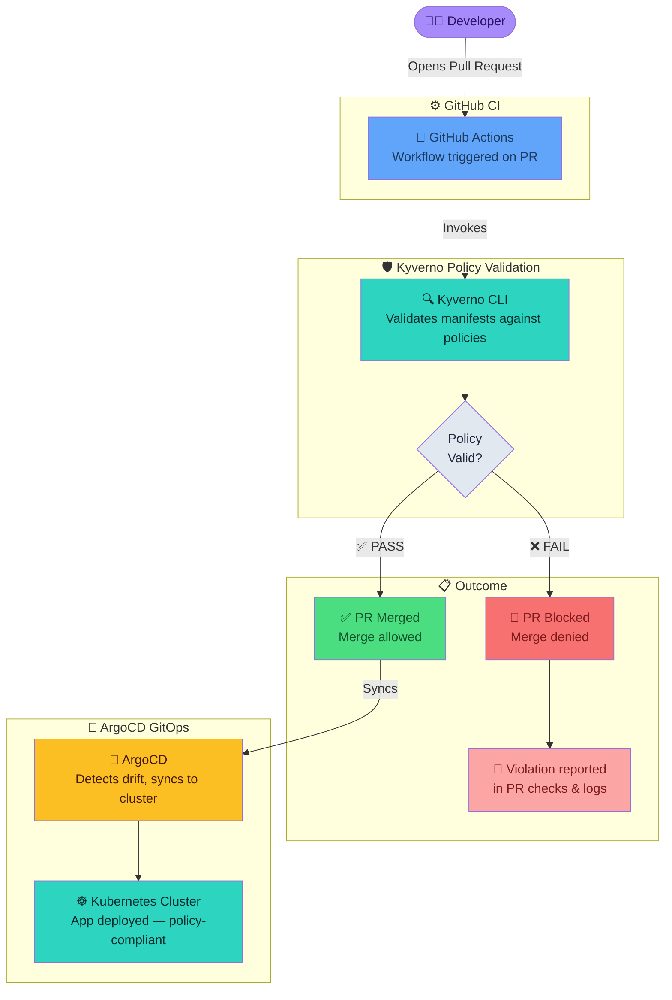

## Overview

This project demonstrates how to shift Kubernetes policy enforcement left into the development workflow using Kyverno CLI and GitHub Actions.
Instead of discovering policy violations at deployment time, this approach validates manifests during pull requests — preventing invalid configurations from ever reaching the cluster.

## Context
We use ArgoCD for GitOps-based deployments across all GKE clusters. The problem with only running Kyverno as an admission controller is that developers only get policy feedback at deploy time — which is too late in the loop.

## Problem
A developer would write their YAML, raise a PR, get it merged, and only discover a Kyverno policy violation when ArgoCD tried to sync — breaking the deployment pipeline in front of the whole team. The feedback cycle was too long and the failure was too public.

## How Kyverno solved it
We integrated the Kyverno CLI into our GitHub Actions pipeline. On every pull request, the pipeline runs kyverno apply against all changed manifests with our full policy set. If any manifest violates a policy, the PR check fails immediately — before review, before merge, before ArgoCD ever sees it. This shifts policy enforcement fully left into the developer workflow.

## Business Impact
Policy violation feedback went from 'at deployment time' to 'within 2 minutes of raising a PR'. Developer experience improved significantly — they know exactly what's wrong and can fix it before anyone else is blocked. Our ArgoCD sync failure rate dropped by over 80% within the first month.

### ARCHITECTURE FLOW

